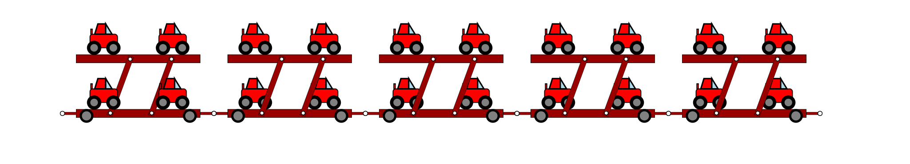

# DII - TPA: Homework 1

First homework of the Advanced Programming Techniques course. Dealine 2021-04-27

For usage, read below.
## Car Trailer

Create a car trailer basing on car's parameters you need to transport.

It's possible to export the generated drawing as .svg file.

With this tool you can obtain several devices, some of them in the following.

### Car trailer for 2 cars-per-floor. 2 floors

### Car trailer for 2 cars-per-floor. 1 floor

### Car trailer for 1 cars-per-floor. 1 floor

### Car trailer for 1 cars-per-floor. 2 floors

This would be structurally unstable. By this, the configuration is not allowed.

### Measures aviable as well

## Machines aviable as well
These are combination of multiple devices, with the implementation of a car's .svg file. Credits to @GiacomoCorradini

# USAGE
## Constrains
There are some constrains you need to deal with:
- Trailer's length must be smaller than canvas width
- Trailer's height must be smaller than 5/4 canvas height
- 2 floors one car configuration is not allowed to preserve structural stability
- Car's length can't be smaller than 4/5 car's height (van configuration)
- More than 2 cars per trailer are not allowed
- More than 2 floors are not allowed

## Commands